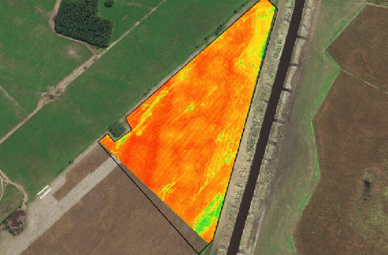

# AI-Specialization-Projects

AI-Specialization - UBA (Universidad Nacional de Buenos Aires) - Final Projects

## Deep Learning exam
Colab: [deep_larning_learning_exam](https://github.com/hernancontigiani/AI-Specialization-Projects/blob/main/deep_learning_exam.ipynb)

## Machine Learning exam
\
Study dataset from heart desease. Select best model and optimize with hyperparameter tuning and AI platforms.\
Colab: [machine_learning_exam](https://github.com/hernancontigiani/AI-Specialization-Projects/blob/main/machine_learning_exam.ipynb)

## Computer vision exam
\
Analyze satelital images from farming, use computer vision model for classify fields\
Colab: [computer_vision_learning_exam](https://github.com/hernancontigiani/AI-Specialization-Projects/blob/main/computer_vision_exam.ipynb)

## Natural language processing exam
\
Sentiment analysis from movies comments. Use differentes approach and compare results:\
- OneHotEncoding
- Words2Vec
- CBOW
- Fasttext and Glove embeddings
- LSTM
- BERT
Colab: [computer_vision_learning_exam](https://github.com/hernancontigiani/AI-Specialization-Projects/blob/main/nlp_exam.ipynb)
